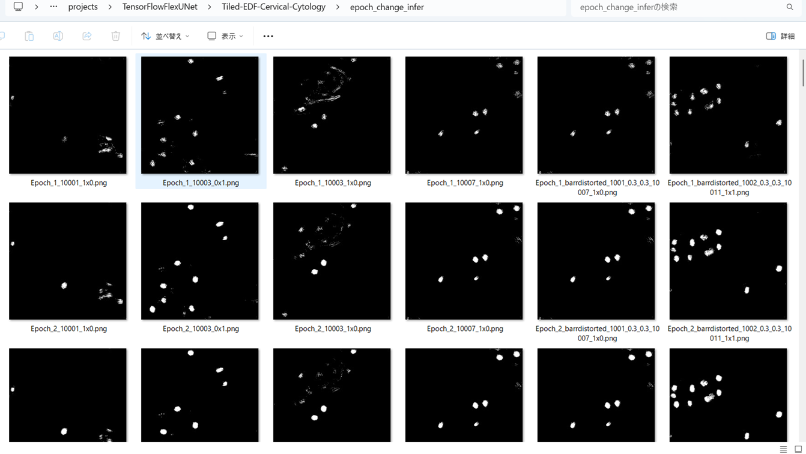

<h2>TensorFlow-FlexUNet-Tiled-Image-Segmentation-EDF-Cervical-Cytology (2025/08/26)</h2>

This is the first experiment of Image Segmentation for EDF Real Cervical Cytology Images, 
 based on our 
 <a href="https://github.com/sarah-antillia/TensorFlow-FlexUNet-Image-Segmentation-Model">
<b>TensorFlowFlexUNet (TensorFlow Flexible UNet Image Segmentation Model for Multiclass)</b></a>
, and a 512x512 pixels 
<a href="https://drive.google.com/file/d/1b8JEmhoRE_A8yxRyyO97EhrkGb_sbU9A/view?usp=sharing">
<b>Augmented-Tiled-EDF-Cervical-Cytology-ImageMask-Dataset.zip</b></a>.
which was derived by us from 
  
<a href="https://cs.adelaide.edu.au/~carneiro/isbi14_challenge/dataset.html">
<b>ISBI 2014 Challeng Dataset</b>
</a>
in <a href="https://cs.adelaide.edu.au/~carneiro/isbi14_challenge/index.html">
<b>Overlapping Cervical Cytology Image Segmentation Challenge - ISBI 2014</b>
</a>
  
On an example of the tileddly-splitted image and mask dataset, please refer to our repository
<a href="https://github.com/sarah-antillia/Tiled-ImageMask-Dataset-Follicular-Cell">
Tiled-ImageMask-Dataset-Follicular-Cell</a>
 
 
As demonstrated in <a href="https://github.com/sarah-antillia/TensorFlow-FlexUNet-Image-Segmentation-STARE-Retinal-Vessel">
TensorFlow-FlexUNet-Image-Segmentation-STARE-Retinal-Vessel</a> ,
 our Multiclass TensorFlowFlexUNet, which uses categorized masks, can also be applied to 
single-class image segmentation models. 
This is because it inherently treats the background as one category and your single-class mask data as 
a second category. In essence, your single-class segmentation model will operate with two categorized classes within our Multiclass UNet framework.
 
 
<b>Acutual Image Segmentation for 512x512 Tiled-EDF-Cervical-Cytology images</b> 

As shown below, the inferred masks predicted by our segmentation model trained on the 
PNG dataset appear similar to the ground truth masks.
 
<table>
<tr>
<th>Input: image</th>
<th>Mask (ground_truth)</th>
<th>Prediction: inferred_mask</th>
</tr>
<tr>
<td></td>
<td></td>
<td></td>
</tr>
<tr>
<td></td>
<td></td>
<td></td>
</tr>
<tr>
<td></td>
<td></td>
<td></td>
</tr>
</table>

 
<h3>1. Dataset Citation</h3>
The image and mask dataset used here has been taken from the following dataset. 
<a href="https://cs.adelaide.edu.au/~carneiro/isbi14_challenge/dataset.html">
<b>ISBI 2014 Challeng Dataset</b>
</a> 
in <a href="https://cs.adelaide.edu.au/~carneiro/isbi14_challenge/index.html">
<b>Overlapping Cervical Cytology Image Segmentation Challenge - ISBI 2014</b>
</a>
 
 
The automated detection and segmentation of overlapping cells using microscopic images obtained from 
Pap smear can be considered to be one of the major hurdles for a robust automatic analysis of cervical cells. 
The Pap smear is a screening test used to detect pre-cancerous and cancerous processes, which consists of a sample of cells 
collected from the cervix that are smeared onto a glass slide and further examined under a microscope. 
The main factors affecting the sensitivity of the Pap smear test are the number of cells sampled, 
the overlap among these cells, the poor contrast of the cell cytoplasm, and the presence of mucus, blood and 
inflammatory cells. Automated slide analysis techniques attempt to 
improve both sensitivity and specificity by automatically detecting, segmenting and classifying the cells present on a slide.
  
<b>
In this challenge, the targets are to extract the boundaries of individual cytoplasm and nucleus 
from overlapping cervical cytology images.
</b>
 
The First Segmentation of Overlapping Cervical Cells from Extended Depth of Field Cytology Image Challenge is 
held under the auspices of the IEEE International Symposium on Biomedical Imaging (ISBI 2014) held in Beijing,
 China on April 28th - May 2nd, 2013.
 
 
<b>Please cite the dataset by the following papers:</b>
 
<li>“Zhi Lu, Gustavo Carneiro, Andrew P. Bradley, Daniela Ushizima, Masoud S. Nosrati, Andrea G. C. Bianchi,
 Claudia M. Carneiro, and Ghassan Hamarneh. Evaluation of Three Algorithms for the Segmentation of 
 Overlapping Cervical Cells. IEEE Journal of Biomedical and Health Informatics (J-BHI). Jan 2015 (Accepted).”
</li>
<li>
“Zhi Lu, Gustavo Carneiro, and Andrew P. Bradley. An Improved Joint Optimization of Multiple Level Set Functions for the Segmentation of Overlapping Cervical Cells. IEEE Transactions on Image Processing. Vol.24, No.4, pp.1261-1272, April 2015.”
</li>
 
 
<h3>
<a id="2">
2 Tiled-EDF-Cervical-Cytology ImageMask Dataset
</a>
</h3>
 If you would like to train this Tiled-EDF-Cervical-Cytology Segmentation model by yourself,
 please download the dataset from the google drive  
<a href="https://drive.google.com/file/d/1b8JEmhoRE_A8yxRyyO97EhrkGb_sbU9A/view?usp=sharing">
Augmented-Tiled-EDF-Cervical-Cytology-ImageMask-Dataset.zip</a>.
 
, expand the downloaded ImageMaskDataset and put it under <b>./dataset</b> folder to be
<pre>
./dataset
└─Tiled-EDF-Cervical-Cytology
    ├─test
    │   ├─images
    │   └─masks
    ├─train
    │   ├─images
    │   └─masks
    └─valid
        ├─images
        └─masks
</pre>
 
<b>Tiled-EDF-Cervical-Cytology Statistics</b> 
 
 

On the derivation of the augmented dataset, please refer to the following Python scripts: 
<li><a href="./generator/TiledImageMaskDatasetGenerator.py">TiledImageMaskDatasetGenerator.py</a></li>
<li><a href="./generator/split_master.py">split_master.py</a></li>
 

As shown above, the number of images of train and valid datasets is large enough to use for a training set of our segmentation model.
 
 
<b>Train_images_sample</b> 

 
<b>Train_masks_sample</b> 

 
<h3>
3 Train TensorFlowFlexUNet Model
</h3>
 We trained Tiled-EDF-Cervical-Cytology TensorFlowFlexUNet Model by using the following
<a href="./projects/TensorFlowFlexUNet/Tiled-EDF-Cervical-Cytology/train_eval_infer.config"> <b>train_eval_infer.config</b></a> file.  
Please move to ./projects/TensorFlowFlexUNet/Tiled-EDF-Cervical-Cytology and run the following bat file. 
<pre>
>1.train.bat
</pre>
, which simply runs the following command. 
<pre>
>python ../../../src/TensorFlowFlexUNetTrainer.py ./train_eval_infer.config
</pre>

<b>Model parameters</b> 
Defined a small <b>base_filters = 16 </b> and large <b>base_kernels = (9,9)</b> for the first Conv Layer of Encoder Block of 
<a href="./src/TensorFlowFlexUNet.py">TensorFlowFlexUNet.py</a> 
and a large num_layers (including a bridge between Encoder and Decoder Blocks).
<pre>
[model]
;You may specify your own UNet class derived from our TensorFlowFlexModel
model         = "TensorFlowFlexUNet"
generator     =  False
image_width    = 512
image_height   = 512
image_channels = 3
num_classes    = 2

base_filters   = 16
base_kernels   = (9,9)
num_layers     = 8
dropout_rate   = 0.02
dilation       = (1,1)
</pre>
<b>Learning rate</b> 
Defined a very small learning rate.  
<pre>
[model]
learning_rate  = 0.00007
</pre>
<b>Loss and metrics functions</b> 
Specified "categorical_crossentropy" and <a href="./src/dice_coef_multiclass.py">"dice_coef_multiclass"</a>. 
<pre>
[model]
loss           = "categorical_crossentropy"
metrics        = ["dice_coef_multiclass"]
</pre>
<b>Dataset class</b> 
Specifed <a href="./src/ImageCategorizedMaskDataset.py">ImageCategorizedMaskDataset</a> class. 
<pre>
[dataset]
class_name    = "ImageCategorizedMaskDataset"
</pre>
 
<b>Learning rate reducer callback</b> 
Enabled learing_rate_reducer callback, and a small reducer_patience.
<pre> 
[train]
learning_rate_reducer = True
reducer_factor     = 0.4
reducer_patience   = 4
</pre>
<b>Early stopping callback</b> 
Enabled early stopping callback with patience parameter.
<pre>
[train]
patience      = 10
</pre>

<b>RGB Color map</b> 
rgb color map dict for Tiled-EDF-Cervical-Cytology 1+1 classes. 
<pre>
[mask]
; 1+1 classes
; RGB colors     Cervical-Nucleus:white     
rgb_map = {(0,0,0):0,(255,255,255):1,}

</pre>

<b>Epoch change inference callback</b> 
Enabled <a href="./src/EpochChangeInfereuncer.py">epoch_change_infer callback</a></b>. 
<pre>
[train]
epoch_change_infer       = True
epoch_change_infer_dir   =  "./epoch_change_infer"
num_infer_images         = 6
</pre>

By using this callback, on every epoch_change, the inference procedure can be called
 for 6 images in <b>mini_test</b> folder. This will help you confirm how the predicted mask changes 
 at each epoch during your training process.    

<b>Epoch_change_inference output at starting (epoch 1,2,3)</b> 
 
 
<b>Epoch_change_inference output at middlepoint (epoch 25,26,27)</b> 
 
 
<b>Epoch_change_inference output at ending (epoch 52,53,54)</b> 
 
 
In this experiment, the training process was terminated at epoch 54.  
 
 

<a href="./projects/TensorFlowFlexUNet/Tiled-EDF-Cervical-Cytology/eval/train_metrics.csv">train_metrics.csv</a> 
 

 
<a href="./projects/TensorFlowFlexUNet/Tiled-EDF-Cervical-Cytology/eval/train_losses.csv">train_losses.csv</a> 
 

 

<h3>
4 Evaluation
</h3>
Please move to <b>./projects/TensorFlowFlexUNet/Tiled-EDF-Cervical-Cytology</b> folder, 
and run the following bat file to evaluate TensorFlowFlexUNet model for Tiled-EDF-Cervical-Cytology. 
<pre>
./2.evaluate.bat
</pre>
This bat file simply runs the following command.
<pre>
python ../../../src/TensorFlowFlexUNetEvaluator.py ./train_eval_infer_aug.config
</pre>

Evaluation console output: 

  

<a href="./projects/TensorFlowFlexUNet/Tiled-EDF-Cervical-Cytology/evaluation.csv">evaluation.csv</a> 
The loss (categorical_crossentropy) to this Tiled-EDF-Cervical-Cytology/test was very low and dice_coef_multiclass 
very high as shown below.
 
<pre>
categorical_crossentropy,0.0095
dice_coef_multiclass,0.9957
</pre>
 

<h3>
5 Inference
</h3>
Please move <b>./projects/TensorFlowFlexUNet/Tiled-EDF-Cervical-Cytology</b> folder 
,and run the following bat file to infer segmentation regions for images by the Trained-TensorFlowFlexUNet model for Tiled-EDF-Cervical-Cytology. 
<pre>
./3.infer.bat
</pre>
This simply runs the following command.
<pre>
python ../../../src/TensorFlowFlexUNetInferencer.py ./train_eval_infer_aug.config
</pre>

<b>mini_test_images</b> 
 
<b>mini_test_mask(ground_truth)</b> 
 

<b>Inferred test masks</b> 
 
 

<b>Enlarged images and masks of 512x512 pixels</b> 
<table>
<tr>
<th>Image</th>
<th>Mask (ground_truth)</th>
<th>Inferred-mask</th>
</tr>

<tr>
<td></td>
<td></td>
<td></td>
</tr>

<tr>
<td></td>
<td></td>
<td></td>
</tr>

<tr>
<td></td>
<td></td>
<td></td>
</tr>

<tr>
<td></td>
<td></td>
<td></td>
</tr>

<tr>
<td></td>
<td></td>
<td></td>
</tr>

<tr>
<td></td>
<td></td>
<td></td>
</tr>
</table>

 
<h3>
References
</h3>
<b>1. CNSeg:: A dataset for cervical nuclear segmentation</b> 
<a href="https://dl.acm.org/doi/abs/10.1016/j.cmpb.2023.107732">
https://dl.acm.org/doi/abs/10.1016/j.cmpb.2023.107732
</a>
 
@article{ZHAO2023107732, title = {CNSeg: A dataset for cervical nuclear segmentation},  
journal = {Computer Methods and Programs in Biomedicine}, volume = {241}, pages = {107732}, year = {2023}, issn = {0169-2607},  
doi = {https://doi.org/10.1016/j.cmpb.2023.107732},  
url = {https://www.sciencedirect.com/science/article/pii/S016926072300398X}, 
author = {Jing Zhao and Yong-jun He and Shu-Hang Zhou and Jian Qin and Yi-ning Xie} }
 
 
<b>2. ImageMask-Dataset-Cervical-Nucleus</b> 
Toshiyuki Arai @antillia.com 
<a href="https://github.com/sarah-antillia/ImageMask-Dataset-Cervical-Nucleus">
https://github.com/sarah-antillia/ImageMask-Dataset-Cervical-Nucleus</a>

  
<b>3. TensorFlow-FlexUNet-Image-Segmentation-Cervical-Cancer </b> 
Toshiyuki Arai @antillia.com 
<a href="https://github.com/sarah-antillia/TensorFlow-FlexUNet-Image-Segmentation-Cervical-Cancer">
https://github.com/sarah-antillia/TensorFlow-FlexUNet-Image-Segmentation-Cervical-Cancer
</a>
 
 
<b>4. TensorFlow-FlexUNet-Image-Segmentation-Cervical-Nucleus </b> 
Toshiyuki Arai @antillia.com 
<a href="https://github.com/sarah-antillia/TensorFlow-FlexUNet-Image-Segmentation-Cervical-Nucleus">
https://github.com/sarah-antillia/TensorFlow-FlexUNet-Image-Segmentation-Cervical-Nucleus
</a>
 
 
<b>5. Tensorflow-Image-Segmentation-Clustered-Cervical-Cell </b> 
Toshiyuki Arai @antillia.com 
<a href="https://github.com/sarah-antillia/Tensorflow-Image-Segmentation-Clustered-Cervical-Cell">
https://github.com/sarah-antillia/Tensorflow-Image-Segmentation-Clustered-Cervical-Cell
</a>

